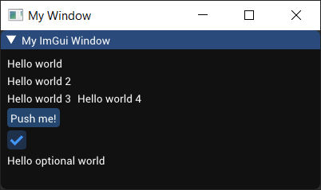

<p align="center">
  
</p>

## A scripting tool to build tools.

```diff
- Warning: Work in progress
```

[](./LICENSE)

[](https://codecov.io/gh/fragcolor-xyz/shards)
[](https://docs.fragcolor.xyz/)
[](https://learn.fragcolor.xyz/)

## Vision
Building a programming tool for the future.
A future where the current *Screen* or *Desktop*, *Mouse* and *Keyboard* are replaced by virtual interfaces within a *VR/MR/AR* environment.

We introduce a low code way of producing high performance and multi-platform apps in the form of a scripting tool that can be both visual and textual at the same time and that represents the flow of data and logic as it is.

## Goals
* Automation scripting for everyone
* A universal interface to your code
* Visual scripting without spaghetti (similar to Apple Shortcuts)
* Shards modularity allows to reuse low level code with minimal efforts between projects
* Machine learning scripting; it's all about building graphs
* Video game engine scripting; even for non-technical artists
* Extremely quick prototyping, creativity unchained
  * From pseudo code to real app
  * Replace pseudo shards with real native shards as you go
* One click release of a fully bundled executable app or library
* Textual representation to allow experienced programmers to use it as well

## Features
* Clear data flow
* Performance driven and easy to profile
* Automatically inferred strong types
* **SIMD** vectors as first class types
* Strong validation, composition and optimization ahead of run-time
* Extremely easy to debug and dissect
* Deterministic execution and performance
* Built on top of **co-routines**, extremely easy to unleash parallelism and low syscall count
* Support **visual editing** without spaghetti and spider webs involvement
* Versatile textual representation (for now backed by a derived **clojure/lisp**)
* Fast execution inspired by threaded code interpreters
* Hot code reloading, without any serialization due to complete decoupled data
* WASM support

## TL;DR

### This

#### Textual version - using a clojure like language (more in the pipeline)

[Read more about the textual language](https://github.com/fragcolor-xyz/shards/wiki/Wire-definition-language)

```clojure
(defwire action
  (Pause 2.0)
  (Msg "This happened 2 seconds later"))

(defmesh main)

(defloop main-loop
  (GFX.MainWindow
   :Title "My Window"
   :Width 400 :Height 200
   :Contents
   (->
    (GUI.Window
     "My GUI Window"
     :Width 400 :Height 200
     :Pos (Int2 0 0)
     :Contents
     (->
      "Hello world"   (GUI.Text)
      "Hello world 2" (GUI.Text)
      "Hello world 3" (GUI.Text)
      "Hello world 4" (GUI.SameLine) (GUI.Text)
      (GUI.Button "Push me!" (->
                              (Msg "Action!")
                              (Detach action)))
      (GUI.Checkbox)
      (When (Is true) (->
                       "Hello optional world" (GUI.Text))))))))

(schedule main main-loop)
(run main 0.02)
```

#### Visual version - using a SwiftUI iOS app

*Work in progress, app source outside of this repository's scope*


### Becomes




Complete of a BGFX context, rendering a ImGui window on a DX11 (windows) and/or Metal (iOS) surface.

## Motivation
In all those years of software engineering I've been touching many fields including, audio, VR, physics, game engines in general but also machine learning, NNs etc... everything interesting and all but all the software I wrote didn't exactly connect to each other and connecting it would have been a big effort. I always wanted to mix things and recombine, experiment, after all I started as a musician using max/msp on my black powerbook pismo...

Shards is my answer to this call, a tool that let's me write specific native code and connect it to any other code I wrote.

Where **Wire** would be your procedure and **Shards** the building shards of your procedure.

With a strong emphasis on automation and repeated tasks. Making each frame of execution of your script first class.

## Current state
Very much work in progress, this project started as a *nim* project, checking the history will show that, but slowly for different many reasons *nim* was fully replaced with *C++*.

The reason behind this switch requires a whole article on its own, but in a nutshell *nim* is cool but it does not interact very well with *C++* and it's very unstable.

Exactly because of this switch some horrors might still exist, please point them out if you are interested, I'm oriented to move to a more *C++17* rich code-base while keeping a *C* interface. (With some exceptions, like avoiding vtables if possible, etc)
