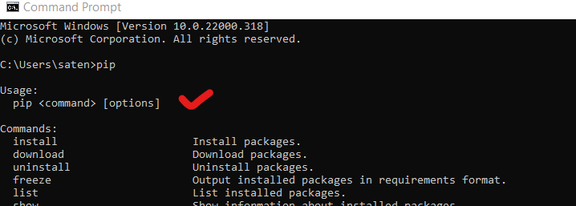

# 1. Installing required packages

At Fragcolor we use the Markdown format and MkDocs/ MkDocs-Material for generating the <a href="https://docs.fragcolor.xyz/" target="_blank">documentation website</a>.

In order to contribute changes to Fragcolor's documentation you need to install Git, Python, MkDocs, and MkDocs-Material.

## 1.1 Git

Git is a version control system that we can use to track and manage changes to our markdown files.

*Git comes pre-installed on most Mac & Linux machines. If it's not on your machine you can get the relevant Git package <a href="https://git-scm.com/download" target="_blank">here</a>.*

Download and install Git for Windows from <a href="https://git-scm.com/download/win" target="_blank">here</a>.

You may choose your favorite editor as the default editor for Git. This editor will be invoked in case you need to resolve git merge conflicts etc.

Retain the other installation defaults.

## 1.2 Python

Python is a pre-requisite for both MkDocs and MkDocs Material.

*Python comes pre-installed on most Mac & Linux machines. If it's not on your machine you can get the relevant Python package <a href="https://www.python.org/downloads/" target="_blank">here</a>.*

For windows you can grab the latest Python release installer <a href="https://www.python.org/downloads/windows/" target="_blank">here</a>.

Download the installer and follow the on-screen instructions after starting installation. 

Remember to add Python to Path during the installation.

And choose to disable the Path Length Limit (just in case your default installation path is in a deeply nested library).

Retain the other default installations settings.

To confirm Python was installed successfully type either Python or Py in the windows command prompt:

> Python

If Python is Installed it will show the version Details 

Typing the following command in the windows command prompt to see where Python is installed:

> where py

Also confirm that PIP (Python's installation package) is installed successfully by typing the following command in the windows command prompt (it's installed automatically with Python):

> pip

 

Official installation instructions for Python on Windows can be found <a href="https://docs.python.org/3/using/windows.html#installation-steps" target="_blank">here</a>.

## 1.3 MkDocs

MkDocs is a documentation static site generator that makes it easy to create and generate documentation.

Once Python is installed you can install MkDocs using the PIP command from the command prompt:
> pip install mkdocs

 

You can check the version of MkDocs installation by using the following command:
> mkdocs --version

For more details refer to the official installation instructions <a href="https://www.mkdocs.org/user-guide/installation/#installing-mkdocs" target="_blank">here</a> .

## 1.4 MkDocs Material

MkDocs Material is a theme for MkDocs and can be installed via the PIP command :

> pip install mkdocs-material

 

Refer to the official MkDocs <a href="https://squidfunk.github.io/mkdocs-material/getting-started/" target="_blank">getting-started documentation</a> for more details.

--8<-- "includes/license.md"
