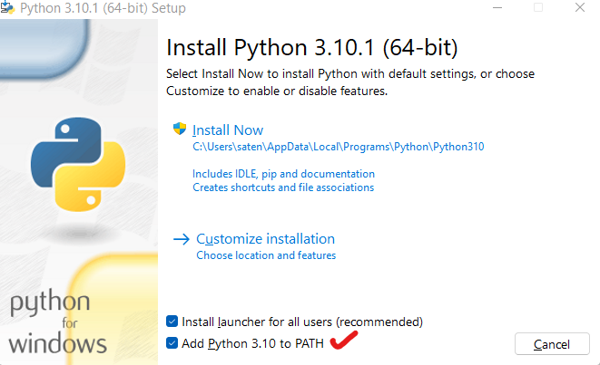
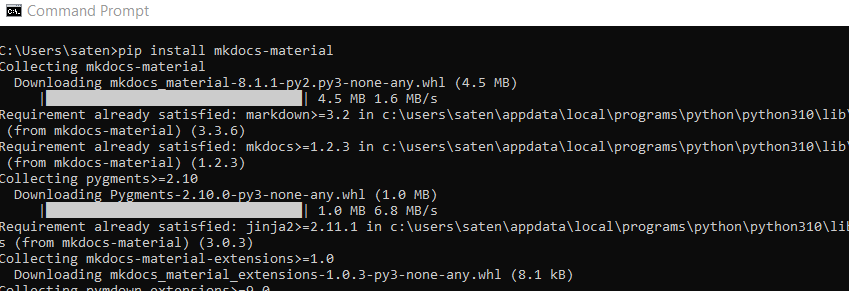

# Installing required packages

We use MkDocs and MkDocs Material to generate the Fragocolor [documentation site](https://docs.fragcolor.xyz/).

Python is a prerequisite for MkDocs and we use git as our version control system. 

So, to contribute documentation to Fragcolor, you'll need all the above packages.

## Git

Git is a version control system that we can use to track and manage changes to our markdown files.

*Git comes pre-installed on most Mac & Linux machines. If it's not on your machine, you can get the relevant git package [here](https://git-scm.com/download).*

For Windows, download and install git from [here](https://git-scm.com/download/win).

Choose your favorite editor as the default git editor. Git will use this editor when there's a need to resolve merge conflicts.


Keep the other installation defaults.

## Python

Python is a pre-requisite for both MkDocs and MkDocs Material.

*Python comes pre-installed on most Mac & Linux machines. If it's not on your machine you can get the relevant Python package [here](https://www.python.org/downloads/).*

For windows, you can grab the latest Python release installer [here](https://www.python.org/downloads/windows/").

Download the installer and follow the on-screen instructions after starting the installation. 

Remember to add Python to Path during the installation.



Disable the Path Length Limit so that your installation can use nested paths.


Keep the other default installation settings.

Type `Python` or `Py` in the terminal to confirm Python installation and version.

=== "Command"

    ```
    Python
    ```

=== "Result"

    

Type `where py` in the terminal to see the Python installation path.

=== "Command"

    ```
    where py
    ```

=== "Result"

    

Type `pip` to confirm PIP installation and version.
*PIP is Python Installation Package and installs as part of Python.*

=== "Command"

    ```
    pip
    ```

=== "Result"

    

*For more details, refer to the official Python installation [documentation](https://docs.python.org/3/using/windows.html#installation-steps).*

## MkDocs

MkDocs allows you to write documentation in markdown and then serve it as a static site. 

Install MkDocs using the `pip` tool.

=== "Command"

    ```
    pip install mkdocs
    ```

=== "Result"

    

Then you can check the version of MkDocs installation by using the following command.

=== "Command"

    ```
    mkdocs --version
    ```

=== "Result"

    

*For more details, refer to the official MkDocs installation [documentation](https://www.mkdocs.org/user-guide/installation/#installing-mkdocs).*

## MkDocs Material

MkDocs Material is a Material Design theme for MkDocs.

Install MkDocs Material using the `'pip` tool.

=== "Command"

    ```
    pip install mkdocs-material
    ```

=== "Result"

    

*For more details, refer to the official MkDocs getting-started [documentation](https://squidfunk.github.io/mkdocs-material/getting-started/).*


--8<-- "includes/license.md"
