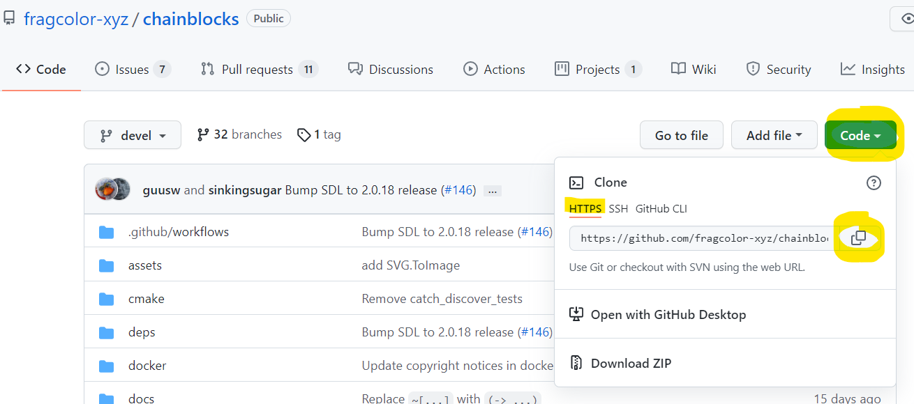
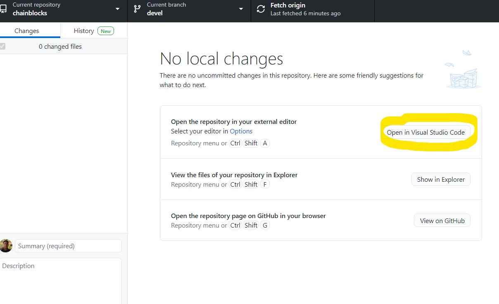
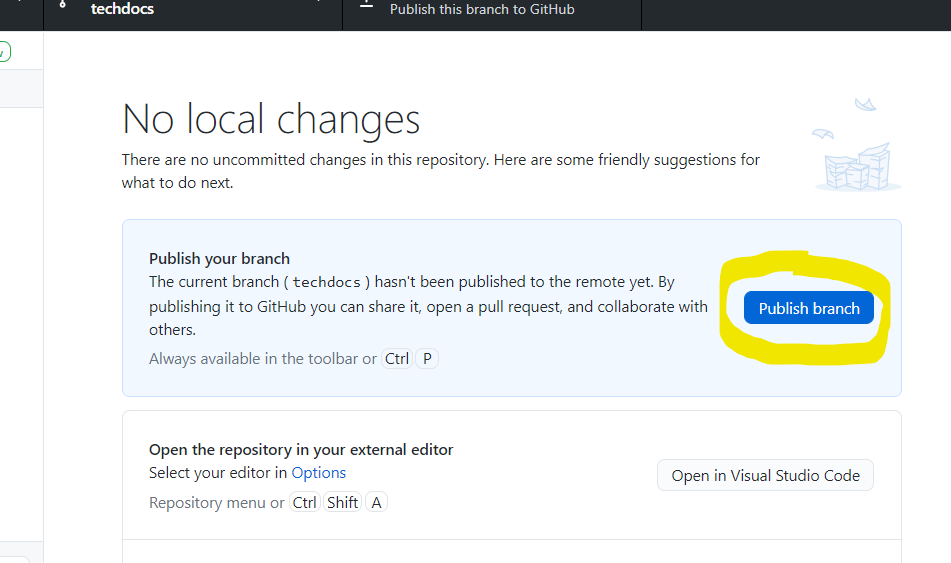
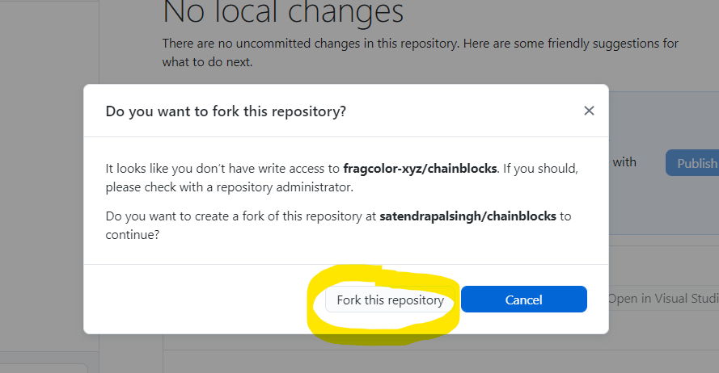
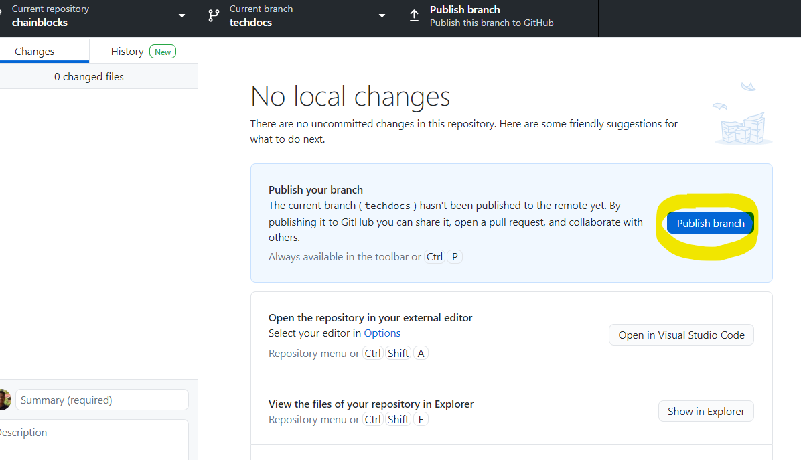
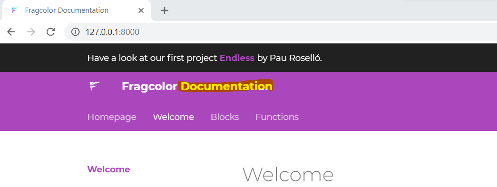

# Contributing changes

Fragcolor documentation is located under the [/docs](https://github.com/fragcolor-xyz/chainblocks/tree/devel/docs) folder of the Chainblocks repository.

Follow these steps to make and contribute document changes.

*We'll be using [Github Desktop](https://desktop.github.com/) to deal with git as this tool is easier to use than the git command line.*

*The process described on this page can be applied to code contributions too.*

## Clone the Repo

To start with, you'll need to get a copy of the Chainblocks repository on your local machine.

Go to the repository's github page. Click the 'Code' button on the right and copy the git repository path (ensure HTTPS is selected) under the heading 'Clone'.

Open Github Desktop (GD) and choose option 'Clone a repository from the Internet...'

Choose the 3rd tab (URL) on the window that opens, and paste the copied git repository URL in the first input box.

*The second input box is the local path where your repository will be cloned. You can change this as desired.*

Once the cloning is complete (might take a couple of minutes depending on the size of the repository) you can view the repository files on your local using your favorite editor (like VS Code) or via your system's file navigator.

*We shall be using [Visual Studio Code](https://code.visualstudio.com/download/) as the code/ document editor for the rest of this guide.*

## Create a branch

Before you can make document changes you need to create a local branch to hold your changes.

A git repository can contain 'branches'. When you create (fork) a new branch you're essentially creating a copy of the original (master) branch which will now diverge depending on what changes go in the master branch and what changes go in this new branch.

*You should **never** work on the main branch of the repository.*

*A related concept is 'merging' where if a branch is merged with another, usually with master, the changes from both or one or the other may be retained.*

You can create a new branch using GD. Click the 'Current Branch' dropdown to show the available branches for this repository. Now click on 'New Branch' button on the right-hand side.

 

A modal will pop-up asking for the new branch's name. This modal also explains on what branch is this new branch based. Ensure that the source branch is the default branch of the repository (in this case it's 'develop').

Click on 'Create Branch'.

Once the branch is created you have the option of publishing it to Github (i.e. pushing a copy of this locally created branch to the remote from we cloned the repository.)

If you do not have write permission to the original repository, you cannot push your newly created branch to it. In such a case GD will ask you to fork the target repository i.e, create a copy of the original repository in your github account.

After forking the repository choose 'To contribute to the parent project' option as we want to contribute changes to the original repository.

Now you can publish the new branch (remember, this will go to the forked repository in your Github account, not to the original repository on Github.)

Once the new branch published GD will show you if there are any uncommitted changes in your local branch (there are none here because we haven't yet made any!)

## Make & test changes 

While working on the documentation you can build and serve the documentation website locally for testing your documentation and your changes to the markdown files will be reflected in real-tinme on served website (hot reloading).

*All the following commands in the terminal or command window must be used after navigating to the folder where MkDocs.yml lives i.e. '...chainblocks/docs'.* 
 
Before starting the MkDocs live-preview server, however, we need to install any plugins that MkDocs might be using (search MkDocs.yml for 'plugins').

In our case we are using only one plugin : [awesome-pages](https://github.com/lukasgeiter/mkdocs-awesome-pages-plugin).

From the documentation home directory (/docs), install MkDocs plugins using the `pip install mkdocs-awesome-pages-plugin` command in the terminal.

=== "Command"

    

Now from the same directory use the `mkdocs serve` command to start the MkDocs live-preview server. On successfull execution of this command you'll see the local URL path that the website is being served at.

=== "Command"

    

=== "Result"

    

Navigate to this path in your local browser to access the served site.

Now we're ready to make some changes!

Let's change the page header's title 'Fragcolor documentation' (sentence case) to 'Fragcolor Documentation' (title case) and save the edit.

Before the change:

After the change:

And now let's go to our local URL to preview this change.

## Commit & push changes

GD will now show a summary of changes in this new local branch.

*Pink color highlights (-) denote text or code that was removed, while blue color highlights (+) denote what was added.*

Once you're happy with your changes it's time to commit (save) these changes to the local repository branch.

To commit the changes click the 'Commit to LOCAL-REPO-NAME' in the bottom left-hand corner.

Next you'll be asked to add summary (commit message) and description.

Add these and then push these changes to the origin remote branch (i.e. the remote original location of our repository) by clicking on 'Push origin' button on the right-hand side.

*The first time you do this git creates this branch on the remote. Subsequent PUSH's only send diffs or changes from the local branch to the (already existing) remote branch.*

At this point GD will show that no local changes exist (since we have committed and pushed to remote origin whatever change we made) and will prompt you to raise a Pull Request.

If you hop over to Github you'll notice similar messages and prompts on your remote origin forked repository.

You can initiate the process of raising a Pull Request from either GD or Github website. In both cases you'll land up on the Github website's Pull Request page as explained in the next section.

## Raise a pull request

To make your changes available for review (and merging back into the remote main branch of the documentation repository) you need to raise a Pull Request (PR) to a reviewer or repository maintainer.

*A pull request merges or combines the changes of the PR branch into the target (main) branch.*

They will review these changes (diffs) and if any changes are needed they will let you know via the Pull Request discussion/ comments section.

After you click 'Create Pull Request' (in GD) or 'Compare & pull request' on Github, you'll land on the 'Open a pull request' page on Github.

Fill in the PR title and message, and click 'Create pull request' button on bottom right-hand corner to create a Pull Request.

Once the Pull Request is created, a unique URL/ page is generated for that PR. This URL can be used to access this PR's page and participate in the review discussion with the PR reviewers and/ or repository maintainers.

This page also specifies the from and to branches this PR was raised for.

A PR reviewer/ repository maintainer can review this PR and if everything is OK they'll close this PR by merging this change back into the master/default branch.

*The PR gets closed but the branch will still exist unless explicitly deleted from both local and remote origin.*

--8<-- "includes/license.md"
